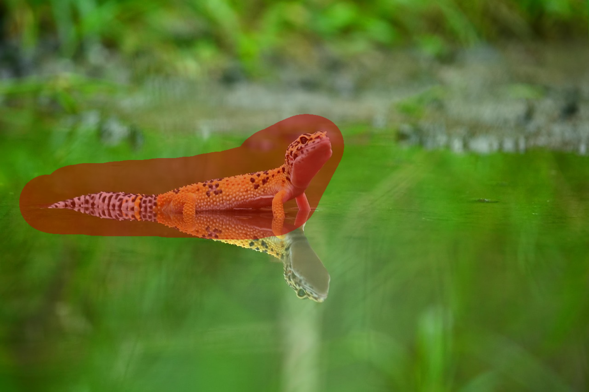
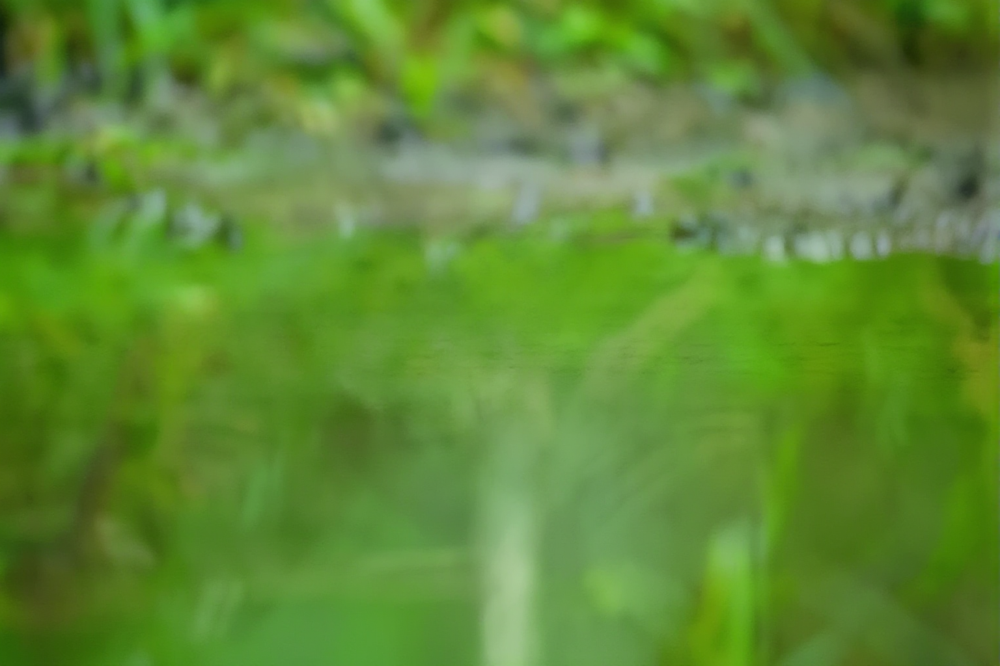
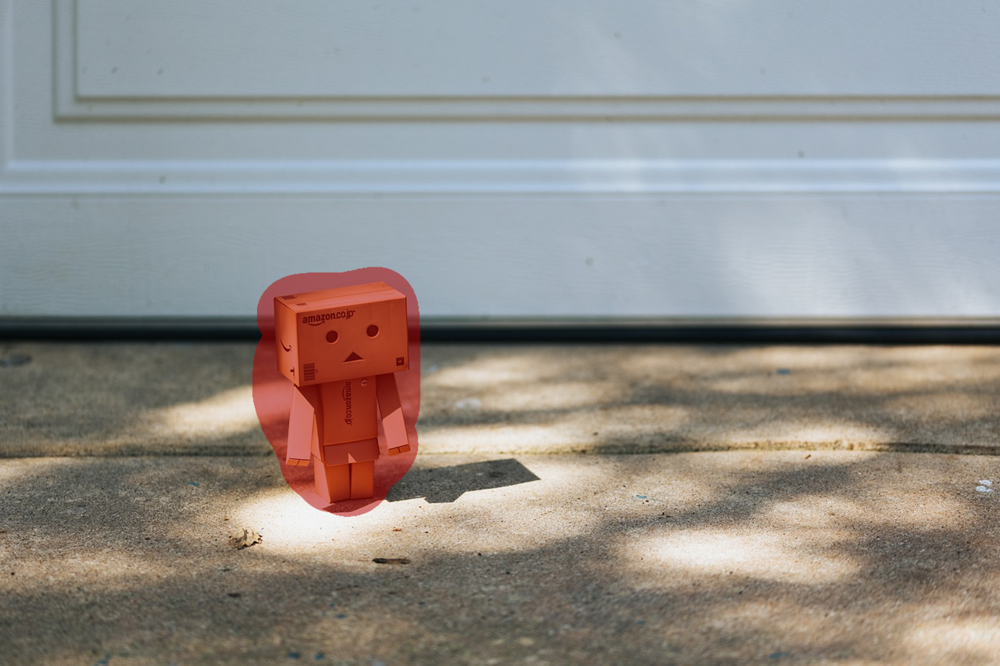
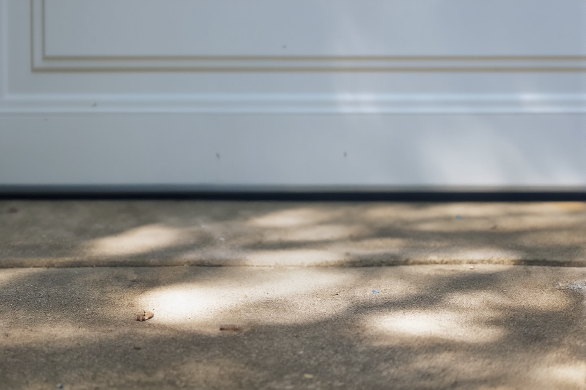
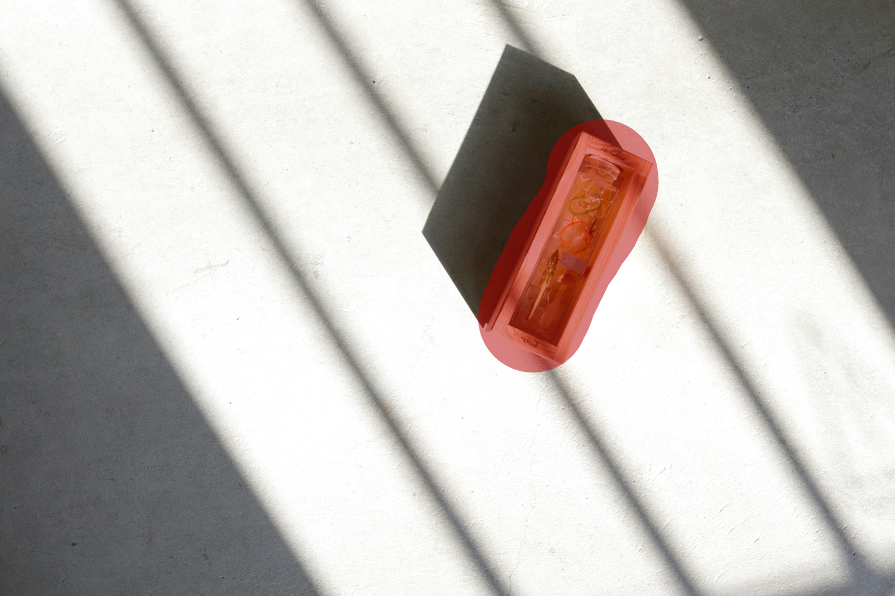
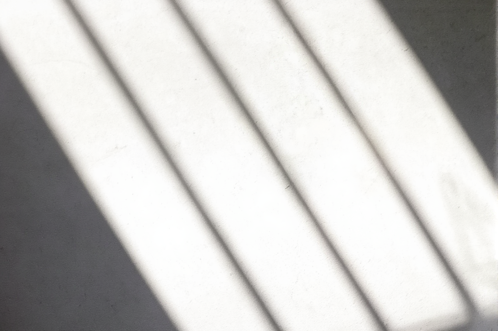
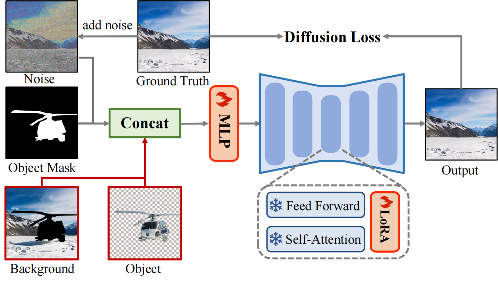
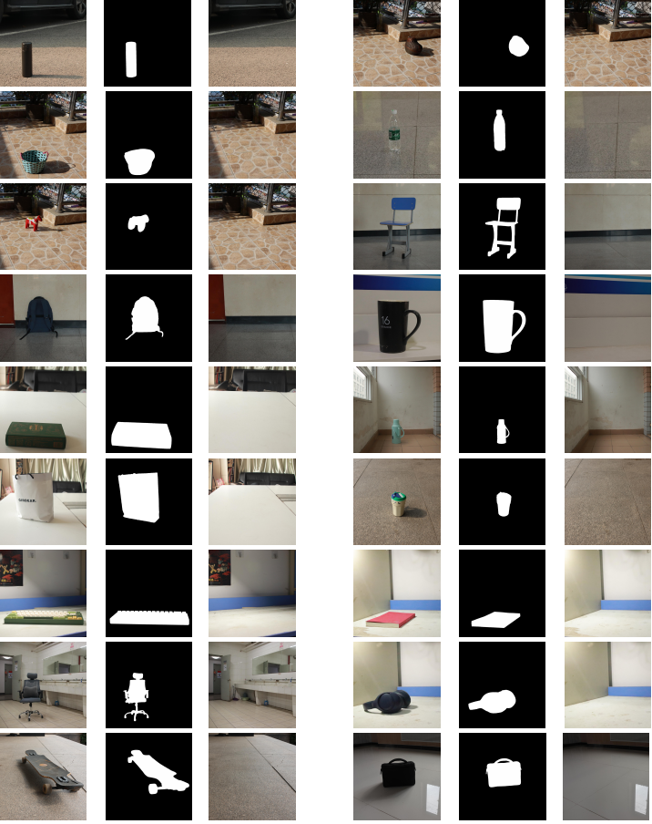

# Image Object Removal

I built this project to remove unwanted objects from photos — not just the object itself, but also the shadow and reflection it leaves behind. You give it an image and a mask (telling it what to remove), and it gives you back a clean photo as if the object was never there.

Under the hood it uses a diffusion model (FLUX) with a LoRA adapter trained specifically for removal. I took the idea from a research paper called [OmniEraser](https://arxiv.org/abs/2501.07397) and set up the code so I can experiment with it, train on my own data, and plug it into a simple web UI.

---

## Results

Here are some real examples — input on the left, output on the right:

| Input (with object) | Output (object removed) |
|:---:|:---:|
|  |  |
|  |  |
|  |  |
|  |  |

Notice how shadows and reflections are also cleanly removed, not just the object itself.

---

## What can it do?

- Remove objects from real-world photos (people, signs, cars, random clutter — anything you mask).
- Handles tricky stuff like shadows and reflections that most inpainting tools leave behind.
- Works on anime/illustration style images too, not just photographs.
- Comes with a Gradio web interface so you can upload, draw a mask, and see the result instantly.
- You can also train your own LoRA if you have paired data (with-object vs without-object images).

---

## How the project is organized

I kept things simple — there are only a few folders and each one has one job:

```
.
├── omnieraser/          ← The actual model code. You import from here.
│   ├── pipeline_flux_control_removal.py   (the diffusion pipeline)
│   └── utils.py                           (training helpers)
│
├── scripts/             ← Things you run from the terminal.
│   ├── test_control_lora_flux.py          (quick test — does it work?)
│   ├── gradio_control_lora_flux.py        (web UI)
│   ├── train_control_lora_flux.py         (training script)
│   └── train_control_lora_flux.sh         (shell command to start training)
│
├── configs/             ← Settings for training (GPU count, precision, etc.)
│   └── accelerate.yaml
│
├── example/             ← A few sample images and masks to play with.
│   ├── image/
│   └── mask/
│
├── ControlNet_version/  ← A different variant that uses ControlNet. Self-contained.
├── requirements.txt     ← Python dependencies
└── pyproject.toml       ← So you can do `pip install -e .`
```

The rule is straightforward:
- `omnieraser/` is the library — you import stuff from it.
- `scripts/` is where you run things — test, train, launch the UI.
- Everything else is config, data, or the website.

If you want the full walkthrough of every file, check [docs/PROJECT_STRUCTURE.md](docs/PROJECT_STRUCTURE.md).

For the deep technical stuff:
- [docs/ARCHITECTURE.md](docs/ARCHITECTURE.md) — model components, tensor shapes, LoRA config, channel expansion
- [docs/INFERENCE.md](docs/INFERENCE.md) — line-by-line inference walkthrough with shapes at every stage
- [docs/TRAINING.md](docs/TRAINING.md) — dataset format, loss function, all hyperparameters, memory requirements

---

## Getting started

### 1. Set up your environment

```bash
git clone https://github.com/Gaurav14cs17/ImageObjectRemoval.git
cd ImageObjectRemoval

python -m venv .venv
source .venv/bin/activate
```

### 2. Install everything

```bash
pip install -r requirements.txt
pip install -e .
```

That second command (`pip install -e .`) registers the `omnieraser` folder as a proper Python package. After that, `from omnieraser import ...` works from anywhere.

If you don't want to do the editable install for some reason, you can also just run commands with `PYTHONPATH=.` in front, like `PYTHONPATH=. python scripts/test_control_lora_flux.py`.

### 3. Try it out

The fastest way to see it work:

```bash
python scripts/test_control_lora_flux.py
```

This grabs the FLUX model and the LoRA weights from Hugging Face (first run will download a few GB), takes one of the sample images from `example/`, removes the masked object, and saves the result as `flux_inpaint.png`.

### 4. Use the web UI

```bash
python scripts/gradio_control_lora_flux.py
```

This opens a local page at `http://localhost:7999`. Upload any photo, draw over the thing you want gone, hit the button, done.

### 5. Train on your own data (optional)

If you have your own dataset of paired images (same scene with and without the object):

1. Open `scripts/train_control_lora_flux.sh` and change the dataset path and output path.
2. Check `configs/accelerate.yaml` matches your GPU setup.
3. Run it:

```bash
bash scripts/train_control_lora_flux.sh
```

---

## How it actually works



Here is the short version:

1. **FLUX** is a text-to-image diffusion model (like Stable Diffusion, but newer). It normally takes text and generates an image from noise.

2. We modify its input layer so it can also accept the original photo and a mask alongside the noise. That means the model now has 4x the input channels it normally does (64 becomes 256).

3. A **LoRA adapter** (a small trainable layer, rank 32) is plugged into the model and trained on paired data — thousands of images where we know what the scene looks like with and without the object.

4. At inference time, you feed in the image + mask, the model runs 28 denoising steps, and you get back a clean version. The text prompt is just something like *"There is nothing here."*

### Inference flow (how a single image gets cleaned)

```
  ┌─────────────┐    ┌──────────┐
  │  Your photo  │    │   Mask   │
  └──────┬───────┘    └────┬─────┘
         │                 │
         └────────┬────────┘
                  │
                  v
         ┌────────────────┐
         │  VAE  Encoder   │
         └───────┬─────────┘
                 │
                 v
    ┌────────────────────────┐      ┌──────────────────────┐
    │  Image latents         │      │  Text prompt           │
    │  + Mask latents        │      │  "There is nothing     │
    │  + Random noise        │      │   here."               │
    └───────────┬────────────┘      └──────────┬─────────────┘
                │                              │
                │                              v
                │                   ┌──────────────────────┐
                │                   │  Text Encoders       │
                │                   │  (CLIP + T5)         │
                │                   └──────────┬───────────┘
                │                              │
                │                              v
                │                   ┌──────────────────────┐
                │                   │  Text embeddings     │
                │                   └──────────┬───────────┘
                │                              │
                └──────────────┬───────────────┘
                               │
                               v
                ┌──────────────────────────────┐
                │   FLUX Transformer            │
                │   + LoRA adapter (rank 32)    │
                │                               │
                │   Runs 28 denoising steps     │
                └──────────────┬────────────────┘
                               │
                               v
                    ┌──────────────────┐
                    │  Cleaned latents  │
                    └────────┬─────────┘
                             │
                             v
                    ┌────────────────┐
                    │  VAE  Decoder   │
                    └────────┬───────┘
                             │
                             v
                  ┌────────────────────┐
                  │  Clean output photo │
                  │  (object + shadow   │
                  │   removed)          │
                  └─────────────────────┘
```

Step by step, this is what happens when you run inference:

1. Your photo and mask go through the VAE encoder and get turned into small latent tensors.
2. The text prompt gets encoded separately by CLIP and T5 text encoders.
3. These latents (image + mask + random noise) and text embeddings are fed into the FLUX transformer, which has the LoRA adapter plugged in.
4. The transformer runs 28 denoising steps — each step it predicts and removes a bit of noise, gradually revealing the clean version underneath.
5. The final cleaned latents go through the VAE decoder and come out as a normal image.

### Training flow (how the LoRA gets trained)

```
  ┌─────────────────────────────────┐
  │  Training dataset               │
  │  (paired with-object &          │
  │   without-object images)        │
  └────────────────┬────────────────┘
                   │
                   v
       ┌───────────────────────┐
       │  PairedRandomCrop     │
       │  (augmentation)       │
       └───────────┬───────────┘
                   │
                   v
          ┌────────────────┐
          │  VAE  Encoder   │
          └───┬────────┬───┘
              │        │
              v        v
   ┌──────────────┐  ┌─────────────────────┐
   │ Ground truth │  │ Condition latents    │
   │ latents      │  │ (image with object   │
   │ (clean img)  │  │  + mask)             │
   └──────┬───────┘  └──────────┬───────────┘
          │                     │
          v                     │
   ┌──────────────┐             │         ┌───────────────┐
   │ Add noise    │             │         │ Text prompt   │
   │ (random      │             │         └───────┬───────┘
   │  timestep)   │             │                 │
   └──────┬───────┘             │                 v
          │                     │         ┌───────────────┐
          v                     │         │ Text Encoders │
   ┌──────────────┐             │         │ (frozen)      │
   │ Noisy latents│             │         └───────┬───────┘
   └──────┬───────┘             │                 │
          │                     │                 │
          └─────────┬───────────┴─────────────────┘
                    │
                    v
     ┌───────────────────────────────────┐
     │  FLUX Transformer (frozen)        │
     │  + LoRA adapter   (trainable)     │
     └──────────────────┬────────────────┘
                        │
                        v
              ┌───────────────────┐
              │  Predicted noise   │
              └─────────┬─────────┘
                        │
                        v
     ┌─────────────────────────────────────┐
     │  Loss = predicted noise vs actual   │
     └──────────────────┬──────────────────┘
                        │
                        │  backprop
                        │  (only updates LoRA weights)
                        v
                    ┌────────┐
                    │  Done   │
                    └─────────┘
```

During training, the base FLUX model is frozen — only the small LoRA layers get updated. That's why it trains fast and the weight file is small (just the LoRA adapter, not the whole model).

### Full project flow (how everything connects)

```
  ┌──────────────────────────────────────────────────────────────────────┐
  │                        Hugging Face Hub                              │
  │                  (FLUX.1-dev + LoRA weights)                         │
  └────────────┬──────────────────┬──────────────────┬───────────────────┘
               │                  │                  │
               v                  v                  v
  ┌─────────────────┐  ┌──────────────────┐  ┌──────────────────────┐
  │ test_control_   │  │ gradio_control_  │  │ train_control_       │
  │ lora_flux.py    │  │ lora_flux.py     │  │ lora_flux.py         │
  │ (quick test)    │  │ (web UI)         │  │ (training loop)      │
  └───┬─────────┬───┘  └───┬─────────┬───┘  └──┬──────────┬────┬───┘
      │         │           │         │          │          │    │
      │         │           │         │          │          │    │
  ┌───┴─────────┴───────────┴─────────┘          │          │    │
  │   imports from                                │          │    │
  v                                               v          │    │
  ┌──────────────────────────────────┐    ┌────────────┐     │    │
  │  omnieraser/                     │    │ omnieraser/ │     │    │
  │  pipeline_flux_control_          │    │ utils.py    │     │    │
  │  removal.py                      │    └─────────────┘     │    │
  │  (diffusion pipeline)            │                        │    │
  └──────────────────────────────────┘                        │    │
                                                              │    │
  ┌──────────────────────┐    ┌───────────────────────┐       │    │
  │  example/            │    │  configs/              │       │    │
  │  image/ + mask/      │    │  accelerate.yaml       │───────┘    │
  │  (sample data)       │────┘  (GPU & precision)     │            │
  └──────────────────────┘    └────────────────────────┘            │
                                                                    │
                              ┌────────────────────────┐            │
                              │  train_control_         │           │
                              │  lora_flux.sh           │───────────┘
                              │  (launch command)       │
                              └─────────────────────────┘
```

This diagram shows how the folders talk to each other. The core pipeline lives in `omnieraser/`, the scripts import from it, weights come from Hugging Face, and sample data comes from `example/`.

---

## Where do the model weights come from?

Everything downloads automatically the first time you run the code. Here is what gets pulled:

- **FLUX backbone** — [black-forest-labs/FLUX.1-dev](https://huggingface.co/black-forest-labs/FLUX.1-dev) (the base diffusion model)
- **LoRA weights** — [theSure/Omnieraser](https://huggingface.co/theSure/Omnieraser/tree/main) (the fine-tuned adapter for object removal)
- **ControlNet weights** (if you use that variant) — [theSure/Omnieraser_Controlnet_version](https://huggingface.co/theSure/Omnieraser_Controlnet_version/tree/main)

You don't need to download anything manually.

---

## If you want to read the code and learn

I'd suggest going through the files in this order:

1. **`scripts/test_control_lora_flux.py`** — Start here. It's about 70 lines and shows the full flow: load model, inject LoRA, process one image, save result. You'll understand the whole pipeline just from this.

2. **`omnieraser/pipeline_flux_control_removal.py`** — This is the big one. It has the actual diffusion pipeline: how the image gets encoded into latents, how the denoising loop runs, how the final image gets decoded. Read it after you understand what the test script does.

3. **`omnieraser/utils.py`** — Small file. Just has `PairedRandomCrop`, which is used during training to randomly crop the image and mask together so they stay aligned.

4. **`scripts/train_control_lora_flux.py`** — The training loop. How data is loaded, how the LoRA is configured, how the loss is computed, how checkpoints are saved. This one is long (~1400 lines) but most of it is boilerplate from HuggingFace's training examples.

5. **`scripts/gradio_control_lora_flux.py`** — Shows how to wrap the pipeline in a web UI. Good to read if you want to build your own interface later.

---

## About the ControlNet variant

There's a separate folder called `ControlNet_version/`. It does the same job (object removal) but uses ControlNet instead of plain LoRA for better background consistency. It's completely self-contained — has its own pipeline, its own model files, its own training script, even its own `requirements.txt`.

If you want to try it, just go into that folder and follow its own instructions. You don't need to understand it to use the main project.

---

## Benchmark comparison

How this method compares against other removal approaches on a real test set:



---

## Credit

The method and the pre-trained weights come from this paper:

> **OmniEraser: Remove Objects and Their Effects in Images with Paired Video-Frame Data**
> Runpu Wei, Zijin Yin, Shuo Zhang, Lanxiang Zhou, Xueyi Wang, Chao Ban, Tianwei Cao, Hao Sun, Zhongjiang He, Kongming Liang, Zhanyu Ma
> [arXiv:2501.07397](https://arxiv.org/abs/2501.07397) (2025)

```bibtex
@article{wei2025omnieraserremoveobjectseffects,
  title   = {OmniEraser: Remove Objects and Their Effects in Images
             with Paired Video-Frame Data},
  author  = {Runpu Wei and Zijin Yin and Shuo Zhang and Lanxiang Zhou
             and Xueyi Wang and Chao Ban and Tianwei Cao and Hao Sun
             and Zhongjiang He and Kongming Liang and Zhanyu Ma},
  journal = {arXiv preprint arXiv:2501.07397},
  year    = {2025},
  url     = {https://arxiv.org/abs/2501.07397},
}
```

---

## License

This is a research/learning project. If you plan to use it commercially, check the licenses for [FLUX.1-dev](https://huggingface.co/black-forest-labs/FLUX.1-dev) and the [OmniEraser weights](https://huggingface.co/theSure/Omnieraser) first — they have their own terms.
